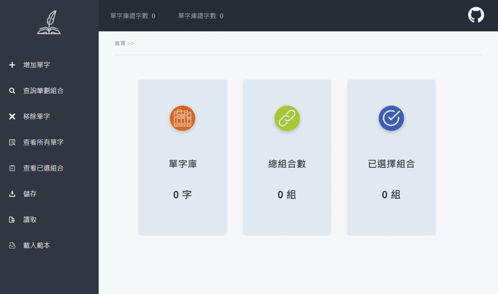
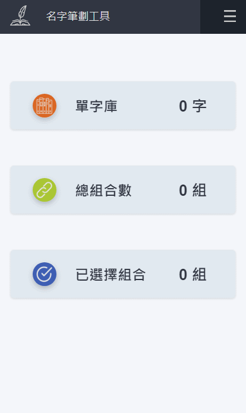
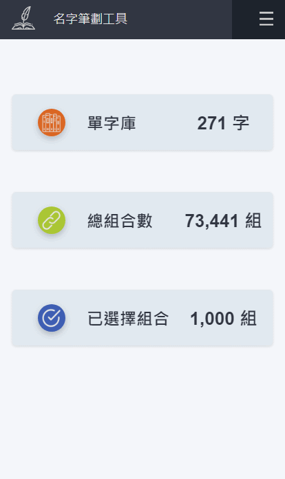

# 名字筆劃工具

主要針對電腦使用者設計

幫助中文使用者來快速篩選出符合筆劃規則之名字的網頁應用程式

[Demo](https://shinenic.github.io/strokes-operation-react/)

 

 

## 功能

* 增加單字
  * 能過濾非中文字元及已存在之單字，一次新增多個中文單字到單字庫，成功新增後回傳通知
* 查詢筆畫組合
  * 透過輸入總筆劃列出所有兩單字筆劃加總為該數字的名字組合
  * 可篩選特定單字作為搜尋條件
  * 搜尋畫面可透過點擊選擇適合的名字做為紀錄
  * 按下搜尋畫面的輸出可顯示目前已選擇的組合
* 移除單字
  * 能過濾非中文字元及已存在之單字，一次從單字庫刪除多個中文單字，成功刪除後回傳通知
* 查看所有單字
  * 查看單字庫之所有單字以及其筆劃數
* 查看已選組合
  * 查看所有已選擇的名字組合及其筆劃數
* 儲存 & 讀取
  * 目前暫時以下載 & 讀取 .txt 檔作為紀錄之方法
* 載入範本
  * 以台灣內政部提供之國內常用名字1000個組合做為範例，載入不重複單字 271 個以及 1000 個組合

## 使用技術

* React
* Redux
* Styled-Component
* RWD

#### 關於

> 資料來源: [Unihan Database](http://www.unicode.org/cgi-bin/UnihanRadicalIndex.pl?strokes=6)

